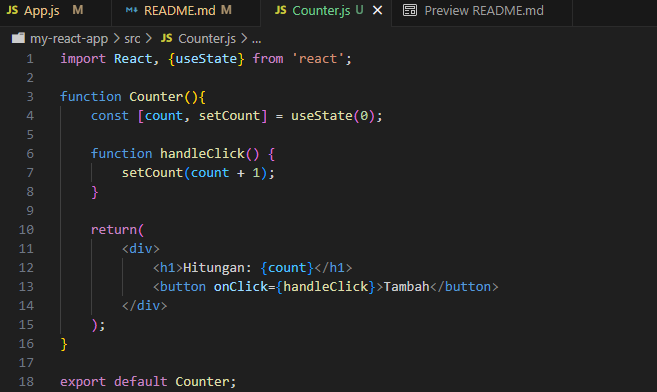
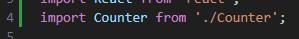
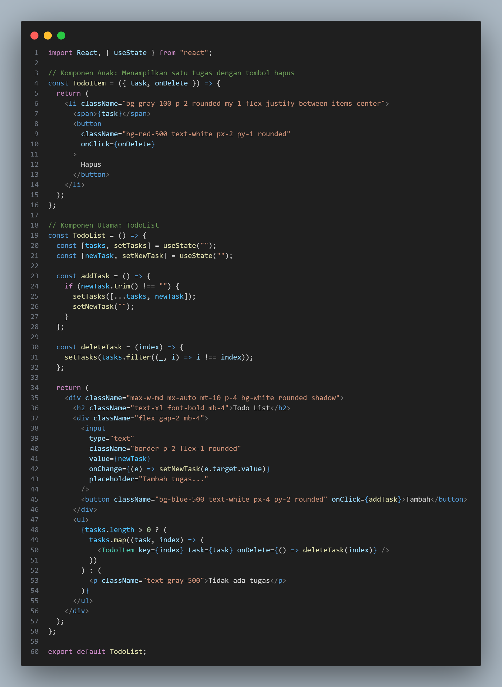
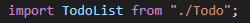
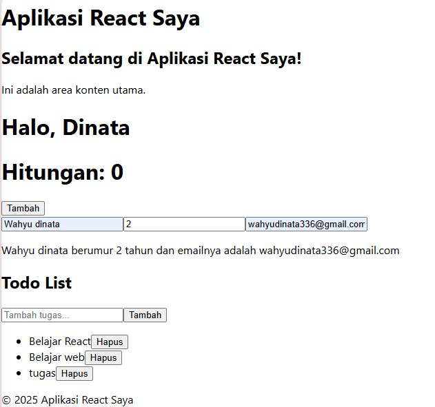

## Laporan Praktikum

|  | Pemrograman Berbasis Framework 2024 |
|--|--|
| NIM |  244107027012|
| Nama |  Wahyudinata |
| Kelas | 4K-RPL |

### 1. Persiapan Lingkungan
1. Mengecek instalasi Node.js dan npm  

2. Membuat direktori baru dan Inisialisasi proyek  

3. Menjalankan aplikasi React  

### 2. Membuat Komponen React
1. Menambahkan beberapa komponen pada App.js  

2. Menjalankan di browser  

### 3. Menggunakan JSX untuk Membuat Komponen Dinamis
1. Menambahkan komponen Counter pada direktori Counter.js dan import komponen  

2. Menambahkan komponen Counter kedalam App/js  

3. Menjalankan proyek React

### 4. Menggunakan Props untuk Mengirimkan Data
1. Menambahkan komponen Greeting yang menerima Props dan import  
 
 
2. Menambahkan komponen Greeting ke dalam komponen App dan kirim props name  

3. Menjalankan pada browser

### 5. Menggunakan State untuk Mengelola Data 
1. Menambahkan komponen Example pengelola state di file App.js  
 
2. Menambahkan komponen Example kedalam komponen App  
 
3. Menjalankan proyek  
 

### 6. Mengerjakan Tugas ToDoList
1. Menambahkan komponen baru pada file Todo.js  
 
 
2. Menambahkan komponen TodoList pada App.js  

 3. Hasil  

